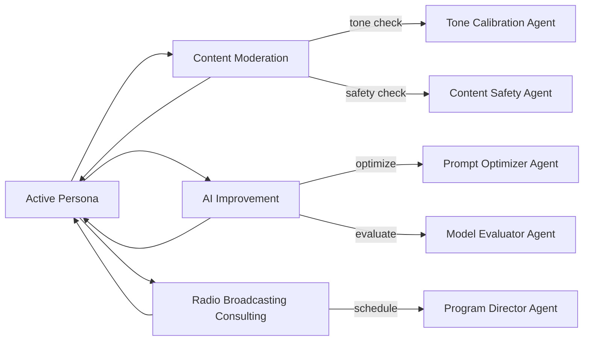
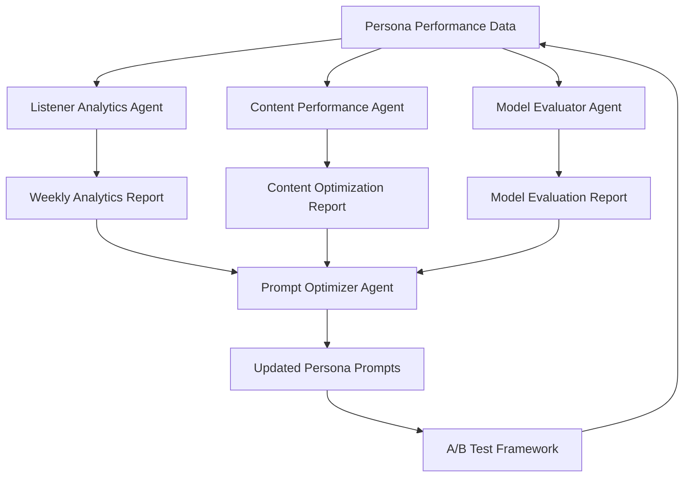

# Persona Ops for Hosts/Presenters

> Part of the **DGN-DJ by DGNradio** platform. See [`AGENTS.md`](AGENTS.md) for agent pipeline rules.

This document defines a practical operations model for managing AI host personas end-to-end in DGN-DJ radio automation.

## 1) Persona Schema

Each persona is represented as a structured object with creative constraints and voice settings.

### Required fields

- `persona_id`: Stable identifier for the presenter persona.
- `display_name`: On-air presenter name.
- `tone`: One or more tone presets (e.g., `warm`, `energetic`, `conversational`).
- `pace`: Target words-per-minute range and pacing style.
- `vocabulary_limits`: Banned/allowed lexical controls and complexity limit.
- `taboo_topics`: Topics the persona should not discuss.
- `voice_model`: Primary TTS provider/model/voice ID.
- `fallback_voice`: Backup provider/model/voice ID.

### Example

```json
{
  "persona_id": "host_ava",
  "display_name": "Ava",
  "tone": ["warm", "upbeat"],
  "pace": {
    "style": "moderate",
    "target_wpm": { "min": 135, "max": 165 }
  },
  "vocabulary_limits": {
    "max_grade_level": 8,
    "banned_words": ["guys"],
    "preferred_phrases": ["good to have you here", "up next"]
  },
  "taboo_topics": ["political endorsements", "medical advice"],
  "voice_model": {
    "provider": "elevenlabs",
    "model": "eleven_multilingual_v2",
    "voice_id": "voice_ava_primary"
  },
  "fallback_voice": {
    "provider": "openai",
    "model": "gpt-4o-mini-tts",
    "voice_id": "alloy"
  }
}
```

## 2) Versioning + Rollback

Personas use lifecycle states:

- `draft`: Editable working copy.
- `approved`: Editorially approved candidate.
- `live`: Active production version.

### Version model

- `version_id` is immutable and semver-like (e.g., `1.3.0`).
- `parent_version_id` links lineage for traceability.
- Every transition writes an audit event with `actor`, `timestamp`, and `reason`.

### Rollback model

- Rollback means repointing `live_pointer` to a prior approved/live version.
- Rollback never mutates history; it appends a new `rollback` event.
- Optional `rollback_policy` can auto-rollback when KPI guardrails are violated.

## 3) A/B Testing by Daypart or Audience Segment

Experiment routing supports:

- **Daypart routing**: morning/afternoon/drive/evening/overnight.
- **Audience segment routing**: e.g., `new_listeners`, `loyal_weekday`, `gen_z_pop`.

### Routing rules

- Experiments are attached to persona versions, not mutable persona drafts.
- Split allocation can be weighted (e.g., `A=70%, B=30%`).
- A deterministic hash (`listener_id` + date) keeps listeners in the same variant for consistency.
- `start_date`, `end_date`, and minimum sample thresholds are required before declaring winners.

## 4) Quality Rubric Scoring

Each generated break/script gets rubric scores (1-5) with optional model + human review:

- `warmth`
- `clarity`
- `authenticity`
- `brand_fit`

### Composite score

```text
composite = 0.25*warmth + 0.25*clarity + 0.25*authenticity + 0.25*brand_fit
```

### Guardrails

- Hard fail if any dimension <= 2.
- Candidate persona versions require a rolling composite >= 4.0 during trial windows.

## 5) Listener Feedback Tracking

Feedback is captured against the active persona variant for each aired segment.

### Input channels

- Thumbs up/down in player UI.
- Optional sentiment extracted from comments/messages.
- Skip/retention proxy metrics (e.g., session drop within 60s of talk break).

### Data linkage

- Every feedback event links to:
  - `persona_id`
  - `persona_version_id`
  - `experiment_id` and `variant_id` (if applicable)
  - `daypart`
  - `audience_segment`

### Iteration loop

1. Aggregate rubric + listener feedback weekly.
2. Detect underperforming dimensions by daypart/segment.
3. Create new `draft` with targeted changes (tone, pace, lexicon, or voice).
4. Re-run approval and A/B testing.

## 6) Suggested Operational KPIs

- Rubric composite trend by version.
- Positive feedback rate by variant.
- Retention delta vs. control variant.
- Rollback frequency and mean time to recovery.

## 7) Implementation Artifact

A concrete configuration artifact is provided in `config/persona_ops.json` with:

- schema definition,
- versioned persona records,
- experiment routing,
- rubric history,
- listener feedback events.

---

## 8) Multi-Persona Team Coordination

> How host personas interact with the agent team organization defined in `AGENTS.md`.

### Persona-Team Interaction Model

Each AI host persona operates within a multi-team support structure:



### Coordination Rules

| Scenario | Responsible Team | Persona Action |
| -------- | ---------------- | -------------- |
| Persona generates content | Content Moderation pre-screens | Hold until cleared |
| A/B test period active | AI Improvement monitors rubric scores | Continue both variants |
| Tone drift detected | Content Moderation (Tone Calibration) | Recalibrate prompt template |
| Programming change | Radio Broadcasting Consulting | Adjust segment structure |
| Quality drop below 3.5 | AI Improvement + Brutal Review | Trigger prompt review |
| Compliance flag raised | Content Moderation (Legal Review) | Pause and reroute content |

### Persona Handoff Protocol

When transitioning between personas (e.g., daypart change from morning to midday):

1. **Current persona** produces session summary with quality metrics.
2. **AI Improvement** reviews transition rubric scores.
3. **Content Moderation** clears incoming persona's opening segment.
4. **Radio Broadcasting Consulting** validates schedule alignment.
5. **New persona** activates with context from previous session.

---

## 9) Radio Consulting Persona Types

> Specialized consulting persona schemas for agent-driven radio consulting.

These are **not** on-air host personas — they are internal advisory personas used by the Radio Broadcasting Consulting and Radio Trend & Analysis teams:

### Program Director Persona

```json
{
  "persona_id": "consulting_pgm_director",
  "type": "consulting",
  "domain": "programming_strategy",
  "expertise": [
    "daypart_optimization",
    "content_mix_strategy",
    "clock_wheel_design",
    "audience_retention"
  ],
  "references": [
    "docs/scheduler_clockwheel_spec.md",
    "docs/autonomy_modes.md"
  ],
  "output_format": "strategic_recommendation"
}
```

### Music Director Persona

```json
{
  "persona_id": "consulting_music_director",
  "type": "consulting",
  "domain": "music_programming",
  "expertise": [
    "rotation_management",
    "genre_balancing",
    "music_bed_selection",
    "jingle_imaging_strategy"
  ],
  "references": [
    "config/schedules.json",
    "docs/scheduler_clockwheel_spec.md"
  ],
  "output_format": "playlist_recommendation"
}
```

### News Director Persona

```json
{
  "persona_id": "consulting_news_director",
  "type": "consulting",
  "domain": "news_content",
  "expertise": [
    "news_segment_structure",
    "breaking_news_protocol",
    "source_verification",
    "editorial_guidelines"
  ],
  "references": [
    "contracts/redaction_rules.md",
    "docs/autonomy_modes.md"
  ],
  "output_format": "editorial_guideline"
}
```

---

## 10) Broadcast Analytics Integration

> How persona performance data feeds into the Radio Trend & Analysis and AI Improvement teams.

### Data Flow



### Analytics Integration Points

| Data Source | Consumer Team | Metric Type | Cadence |
| ----------- | ------------- | ----------- | ------- |
| Rubric composite scores | AI Improvement | Quality | Per-segment |
| Listener session duration | Radio Trend & Analysis | Engagement | Real-time |
| Skip/tune-out events | Radio Trend & Analysis | Retention | Real-time |
| A/B test variant performance | AI Improvement | Optimization | Per-experiment |
| Feedback events (like/dislike) | Radio Trend & Analysis | Sentiment | Event-driven |
| Content type performance | AI Improvement | Content mix | Weekly |

### Feedback Loop Protocol

1. **Collect:** Persona generates content → Content Moderation clears → broadcast.
2. **Measure:** Listener Analytics Agent captures session and engagement metrics.
3. **Analyze:** Content Performance Agent scores segment against rubric.
4. **Optimize:** Prompt Optimizer Agent adjusts templates based on analysis.
5. **Test:** Updated prompts enter A/B test per Section 3 protocol.
6. **Report:** Weekly analytics report delivered to Management and Radio Broadcasting Consulting.
