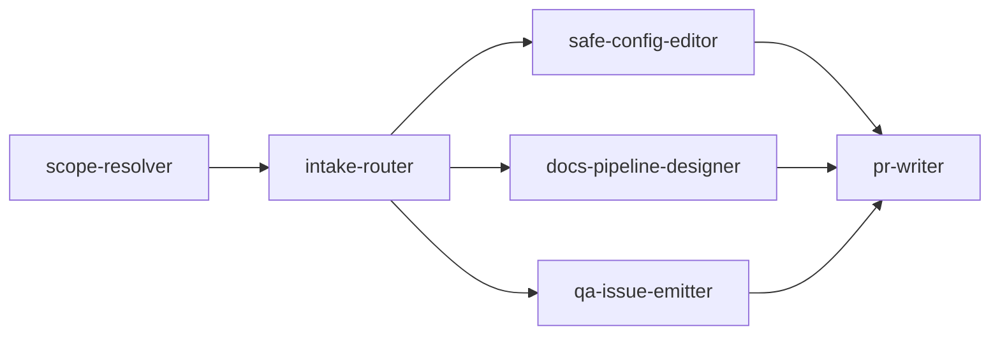

# Skills Registry

This file defines reusable, trigger-based skills for the DGN-DJ repository.
Skills follow the [SKILL.md convention](https://code.visualstudio.com/docs/copilot/customization/agent-skills) with frontmatter metadata for agent discovery.

## Usage Rules

- Choose the smallest skill set that fully covers the request.
- Execute skills in an explicit order; respect dependency chains.
- Keep context lean: load only the sections needed for the active task.

## Skill Dependencies



---

## Available Skills

### scope-resolver

```yaml
---
name: scope-resolver
description: Determine which instruction files apply to the requested change
---
```

- **Purpose:** Resolve the effective agent instructions for any set of target paths.
- **Trigger:** Any task that targets specific files or directories.

#### When to Use

- When modifying files across multiple directories
- When a PR touches more than 3 areas of the repo
- When unsure which `AGENTS.md` applies to a given path
- When a nested `AGENTS.md` might override root-level rules

#### Inputs

- Candidate file/directory paths
- User request text

#### Steps

1. Locate nearest `AGENTS.md` for each target path.
2. Build precedence chain from root → deepest scope.
3. Extract constraints, allowed operations, and required output format.

#### Commands / Tools

- `git diff --name-only` — list changed files to resolve scope for
- `find . -name "AGENTS.md"` — discover all instruction files
- `Get-ChildItem -Recurse -Filter "AGENTS.md"` — PowerShell equivalent

#### Output

Scope map listing effective rules by path, as a markdown table.

#### Boundaries

- ✅ **Always:** Read all `AGENTS.md` files in the path chain
- ⚠️ **Ask first:** If two `AGENTS.md` files have conflicting rules
- 🚫 **Never:** Modify any `AGENTS.md` file during scope resolution

#### Resources

- Root `AGENTS.md` — primary instruction source
- Any nested `AGENTS.md` files in subdirectories

---

### intake-router

```yaml
---
name: intake-router
description: Route requests into QA, Change, or Proposal pipeline modes
---
```

- **Purpose:** Classify incoming requests and assign them to the correct pipeline.
- **Trigger:** New request received or scope changes mid-execution.
- **Depends on:** `scope-resolver` (must run first)

#### When to Use

- At the start of every new user request
- When a task's scope changes during execution
- When the request type is ambiguous (read vs write intent)
- When a request mixes QA and implementation concerns

#### Inputs

- User intent (parsed request text)
- Constraints from `scope-resolver`
- Repository type context

#### Steps

1. Parse requested outcome against the three route definitions.
2. Detect forbidden actions (e.g., no edits in QA mode).
3. Check if request requires multiple routes (split if needed).
4. Assign route, required deliverables, and applicable skills.

#### Commands / Tools

- Review route definitions in `AGENTS.md` → **Route Selection** section
- Cross-reference `SKILLS.md` for applicable skills

#### Output

Route decision + rationale, formatted as:

```markdown
**Route:** QA | Change | Proposal
**Rationale:** [why this route]
**Skills:** [list of activated skills]
**Deliverables:** [expected outputs]
```

#### Boundaries

- ✅ **Always:** Document the routing decision and rationale
- ⚠️ **Ask first:** If the request spans multiple routes
- 🚫 **Never:** Transition to Change mode without explicit implementation intent

---

### qa-issue-emitter

```yaml
---
name: qa-issue-emitter
description: Report actionable issues with implementation task stubs
---
```

- **Purpose:** Produce structured, actionable findings with attached implementation stubs.
- **Trigger:** QA review requests, code inspections, or audit tasks.
- **Depends on:** `intake-router` (must be routed to QA mode)

#### When to Use

- When asked to review code quality or configuration
- When auditing security posture of config files
- When inspecting JSON schemas for inconsistencies
- When performing pre-release sanity checks

#### Inputs

- Static findings and supporting evidence
- File paths and function references

#### Steps

1. State each issue succinctly with severity (🔴 critical / 🟡 warning / 🔵 info).
2. Immediately add a task stub with implementation instructions.
3. Include module paths, key functions, and search anchors.
4. Group related issues under common headings.

#### Commands / Tools

- `python -m json.tool <file>` — validate JSON syntax
- `python config/inspect_db.py` — inspect DB schemas (read-only)
- `git log -n 5 --oneline` — recent change context

#### Output

Ordered findings with one task stub per issue, formatted as:

```markdown
### 🔴 [Issue Title]
**File:** `path/to/file`
**Evidence:** [what was found]

> **Task Stub:**
> - Fix: [specific action]
> - Location: `module.function_name`
> - Search anchor: `"string to find"`
```

#### Boundaries

- ✅ **Always:** Include file paths and search anchors in every finding
- ⚠️ **Ask first:** Before flagging architectural concerns (may need Proposal route)
- 🚫 **Never:** Emit fix implementations outside task-stub blocks; never edit files in QA mode

---

### safe-config-editor

```yaml
---
name: safe-config-editor
description: Safely update runtime config files with backup and validation
---
```

- **Purpose:** Apply minimal, validated changes to configuration files.
- **Trigger:** Changes to files under `config/` involving JSON or text files.
- **Depends on:** `scope-resolver` (confirms file is in scope)

#### When to Use

- When updating schedule times or prompt variables
- When adding new entries to JSON config arrays
- When correcting typos in markdown documentation
- When modifying Python utility scripts in `config/scripts/`

#### Inputs

- Target config file path
- Desired value changes (key-value pairs or diff)

#### Steps

1. Confirm file type is editable (`.json`, `.py`, `.md`, `.txt`).
2. Create backup in `config/backups/` with timestamp suffix.
3. Apply minimal diff — change only the target values.
4. Validate syntax (JSON parse, Python compile check).
5. Preserve formatting conventions (indentation, key order).

#### Commands / Tools

- `python -m json.tool <file>` — validate JSON after edit
- `python -c "import py_compile; py_compile.compile('<file>')"` — validate Python syntax
- `copy <file> config\backups\<file>_<timestamp>.bak` — create backup (PowerShell)
- `fc <original> <edited>` — verify diff is minimal (Windows)

#### Output

Updated config file + summary of edited keys/values, formatted as:

```markdown
**File:** `config/schedules.json`
**Backup:** `config/backups/schedules_20260213.json`
**Changes:**
| Key | Old Value | New Value |
|-----|-----------|-----------|
| `schedule.morning.time` | `"06:00"` | `"07:00"` |
```

#### Boundaries

- ✅ **Always:** Back up before editing; validate after editing
- ⚠️ **Ask first:** Before changing JSON structure (adding/removing keys)
- 🚫 **Never:** Edit `.db`, `.key`, `.exe`, or binary artifacts

---

### docs-pipeline-designer

```yaml
---
name: docs-pipeline-designer
description: Create or refine pipeline documentation for multi-agent operations
---
```

- **Purpose:** Design and document multi-stage agent pipelines and governance flows.
- **Trigger:** Requests for architecture design, process documentation, or pipeline specs.

#### When to Use

- When designing a new multi-agent workflow
- When refining stage gates or handoff criteria
- When documenting failure-handling procedures
- When creating templates for agent outputs

#### Inputs

- Existing documentation and governance requirements
- Pipeline stage definitions from `AGENTS.md`

#### Steps

1. Define role model with responsibilities per stage.
2. Add decision routing logic and failure-handling paths.
3. Create templates for handoff artifacts (summaries, PR bodies).
4. Add Mermaid diagrams for visual pipeline representation.
5. Validate coverage — every pipeline stage has an entry/exit gate.

#### Commands / Tools

- Review `AGENTS.md` → Multi-Agent Pipeline section
- Review `SKILLS.md` → Skill Dependencies diagram
- `Get-ChildItem docs/ -Recurse` — discover existing documentation

#### Output

Documentation files in root `docs/` or `.agent/` scaffolding, including:

- Pipeline stage definitions with Mermaid diagrams
- Handoff templates
- Failure-handling decision trees

#### Boundaries

- ✅ **Always:** Include entry/exit gates for every stage; use Mermaid for diagrams
- ⚠️ **Ask first:** Before proposing changes to the existing pipeline in `AGENTS.md`
- 🚫 **Never:** Implement pipeline changes without explicit approval; keep guidance deterministic

---

### pr-writer

```yaml
---
name: pr-writer
description: Generate structured PR titles and bodies for repository changes
---
```

- **Purpose:** Automate PR creation with consistent, informative titles and bodies.
- **Trigger:** Any completed change set ready for review.
- **Depends on:** At least one of `safe-config-editor`, `docs-pipeline-designer`, or `qa-issue-emitter`

#### When to Use

- After completing a config edit or documentation update
- After a QA review that generated findings
- When batching multiple small changes into a single PR
- When the Handoff Agent needs to summarize work

#### Inputs

- Commit diff (`git diff`)
- List of impacted files
- Verification notes from Verifier Agent

#### Steps

1. Compose concise Conventional Commit-aligned title (`type: description`).
2. Summarize user-visible changes in the PR body.
3. List all files touched with change categories.
4. Include validation commands run and their results.
5. Note limitations, known issues, or follow-up items.

#### Commands / Tools

- `git diff --cached --stat` — summary of staged changes
- `git log --oneline -n 5` — recent commit context
- `git diff --name-only` — list of changed files

#### Output

PR title and body suitable for direct submission:

```markdown
**Title:** `docs: update schedule config with new morning slot`

**Body:**
## Summary
[User-visible changes]

## Files Changed
| File | Change |
|------|--------|
| `config/schedules.json` | Updated morning time slot |

## Validation
- ✅ `python -m json.tool config/schedules.json` — passed
- ✅ Backup created at `config/backups/schedules_20260213.json`

## Limitations
- [Any known issues or follow-ups]
```

#### Boundaries

- ✅ **Always:** Use Conventional Commit format; include validation results
- ⚠️ **Ask first:** Before submitting the PR (user review required)
- 🚫 **Never:** Include secrets in PR bodies; never make unverifiable claims
