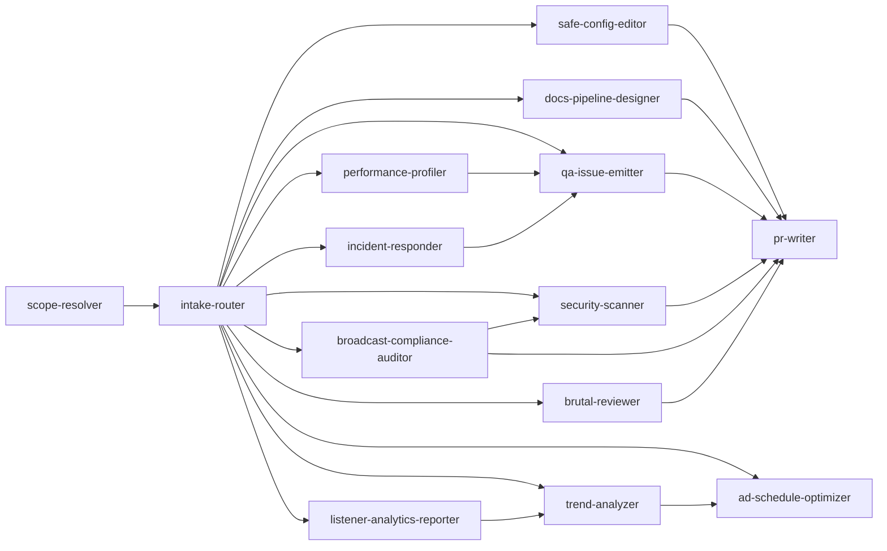

# Skills Registry

This file defines reusable, trigger-based skills for the DGN-DJ repository.
Skills follow the [SKILL.md convention](https://code.visualstudio.com/docs/copilot/customization/agent-skills) with frontmatter metadata for agent discovery.

## Usage Rules

- Choose the smallest skill set that fully covers the request.
- Execute skills in an explicit order; respect dependency chains.
- Keep context lean: load only the sections needed for the active task.

## Skill Dependencies



---

## Available Skills

### scope-resolver

```yaml
---
name: scope-resolver
description: Determine which instruction files apply to the requested change
---
```

- **Purpose:** Resolve the effective agent instructions for any set of target paths.
- **Trigger:** Any task that targets specific files or directories.

#### scope-resolver: When to Use

- When modifying files across multiple directories
- When a PR touches more than 3 areas of the repo
- When unsure which `AGENTS.md` applies to a given path
- When a nested `AGENTS.md` might override root-level rules

#### scope-resolver: Inputs

- Candidate file/directory paths
- User request text

#### scope-resolver: Steps

1. Locate nearest `AGENTS.md` for each target path.
2. Build precedence chain from root → deepest scope.
3. Extract constraints, allowed operations, and required output format.

#### scope-resolver: Commands / Tools

- `git diff --name-only` — list changed files to resolve scope for
- `find . -name "AGENTS.md"` — discover all instruction files
- `Get-ChildItem -Recurse -Filter "AGENTS.md"` — PowerShell equivalent

#### scope-resolver: Output

Scope map listing effective rules by path, as a markdown table.

#### scope-resolver: Boundaries

- ✅ **Always:** Read all `AGENTS.md` files in the path chain
- ⚠️ **Ask first:** If two `AGENTS.md` files have conflicting rules
- 🚫 **Never:** Modify any `AGENTS.md` file during scope resolution

#### scope-resolver: Resources

- Root `AGENTS.md` — primary instruction source
- Any nested `AGENTS.md` files in subdirectories

---

### intake-router

```yaml
---
name: intake-router
description: Route requests into QA, Change, or Proposal pipeline modes
---
```

- **Purpose:** Classify incoming requests and assign them to the correct pipeline.
- **Trigger:** New request received or scope changes mid-execution.
- **Depends on:** `scope-resolver` (must run first)
- **Normative source:** [`docs/operations/subagent_execution_playbook.md`](docs/operations/subagent_execution_playbook.md) for spawn/queue/task-packet rules.

#### intake-router: When to Use

- At the start of every new user request
- When a task's scope changes during execution
- When the request type is ambiguous (read vs write intent)
- When a request mixes QA and implementation concerns

#### intake-router: Inputs

- User intent (parsed request text)
- Constraints from `scope-resolver`
- Repository type context

#### intake-router: Steps

1. Parse requested outcome against the three route definitions.
2. Detect forbidden actions (e.g., no edits in QA mode).
3. Check if request requires multiple routes (split if needed).
4. Assign route, required deliverables, and applicable skills.

#### intake-router: Commands / Tools

- Review route definitions in `AGENTS.md` → **Route Selection** section
- Cross-reference `SKILLS.md` for applicable skills

#### intake-router: Output

Route decision + rationale, formatted as:

```markdown
**Route:** QA | Change | Proposal
**Rationale:** [why this route]
**Skills:** [list of activated skills]
**Deliverables:** [expected outputs]
```

#### intake-router: Boundaries

- ✅ **Always:** Document the routing decision and rationale
- ⚠️ **Ask first:** If the request spans multiple routes
- 🚫 **Never:** Transition to Change mode without explicit implementation intent

---

### qa-issue-emitter

```yaml
---
name: qa-issue-emitter
description: Report actionable issues with implementation task stubs
---
```

- **Purpose:** Produce structured, actionable findings with attached implementation stubs.
- **Trigger:** QA review requests, code inspections, or audit tasks.
- **Depends on:** `intake-router` (must be routed to QA mode)
- **Normative source:** [`docs/operations/subagent_execution_playbook.md`](docs/operations/subagent_execution_playbook.md) for evidence format, confidence ranking, and escalation handling.

#### qa-issue-emitter: When to Use

- When asked to review code quality or configuration
- When auditing security posture of config files
- When inspecting JSON schemas for inconsistencies
- When performing pre-release sanity checks

#### qa-issue-emitter: Inputs

- Static findings and supporting evidence
- File paths and function references

#### qa-issue-emitter: Steps

1. State each issue succinctly with severity (🔴 critical / 🟡 warning / 🔵 info).
2. Immediately add a task stub with implementation instructions.
3. Include module paths, key functions, and search anchors.
4. Group related issues under common headings.

#### qa-issue-emitter: Commands / Tools

- `python -m json.tool <file>` — validate JSON syntax
- `python config/inspect_db.py` — inspect DB schemas (read-only)
- `git log -n 5 --oneline` — recent change context

#### qa-issue-emitter: Output

Ordered findings with one task stub per issue, formatted as:

```markdown
### 🔴 [Issue Title]
**File:** `path/to/file`
**Evidence:** [what was found]

> **Task Stub:**
> - Fix: [specific action]
> - Location: `module.function_name`
> - Search anchor: `"string to find"`
```

#### qa-issue-emitter: Boundaries

- ✅ **Always:** Include file paths and search anchors in every finding
- ⚠️ **Ask first:** Before flagging architectural concerns (may need Proposal route)
- 🚫 **Never:** Emit fix implementations outside task-stub blocks; never edit files in QA mode

---

### safe-config-editor

```yaml
---
name: safe-config-editor
description: Safely update runtime config files with backup and validation
---
```

- **Purpose:** Apply minimal, validated changes to configuration files.
- **Trigger:** Changes to files under `config/` involving JSON or text files.
- **Depends on:** `scope-resolver` (confirms file is in scope)

#### safe-config-editor: When to Use

- When updating schedule times or prompt variables
- When adding new entries to JSON config arrays
- When correcting typos in markdown documentation
- When modifying Python utility scripts in `config/scripts/`

#### safe-config-editor: Inputs

- Target config file path
- Desired value changes (key-value pairs or diff)

#### safe-config-editor: Steps

1. Confirm file type is editable (`.json`, `.py`, `.md`, `.txt`).
2. Create backup in `config/backups/` with timestamp suffix.
3. Apply minimal diff — change only the target values.
4. Validate syntax (JSON parse, Python compile check).
5. Preserve formatting conventions (indentation, key order).

#### safe-config-editor: Commands / Tools

- `python -m json.tool <file>` — validate JSON after edit
- `python -c "import py_compile; py_compile.compile('<file>')"` — validate Python syntax
- `copy <file> config\backups\<file>_<timestamp>.bak` — create backup (PowerShell)
- `fc <original> <edited>` — verify diff is minimal (Windows)

#### safe-config-editor: Output

Updated config file + summary of edited keys/values, formatted as:

```markdown
**File:** `config/schedules.json`
**Backup:** `config/backups/schedules_20260213.json`
**Changes:**
| Key | Old Value | New Value |
|-----|-----------|-----------|
| `schedule.morning.time` | `"06:00"` | `"07:00"` |
```

#### safe-config-editor: Boundaries

- ✅ **Always:** Back up before editing; validate after editing
- ⚠️ **Ask first:** Before changing JSON structure (adding/removing keys)
- 🚫 **Never:** Edit `.db`, `.key`, `.exe`, or binary artifacts

---

### docs-pipeline-designer

```yaml
---
name: docs-pipeline-designer
description: Create or refine pipeline documentation for multi-agent operations
---
```

- **Purpose:** Design and document multi-stage agent pipelines and governance flows.
- **Trigger:** Requests for architecture design, process documentation, or pipeline specs.

#### docs-pipeline-designer: When to Use

- When designing a new multi-agent workflow
- When refining stage gates or handoff criteria
- When documenting failure-handling procedures
- When creating templates for agent outputs

#### docs-pipeline-designer: Inputs

- Existing documentation and governance requirements
- Pipeline stage definitions from `AGENTS.md`

#### docs-pipeline-designer: Steps

1. Define role model with responsibilities per stage.
2. Add decision routing logic and failure-handling paths.
3. Create templates for handoff artifacts (summaries, PR bodies).
4. Add Mermaid diagrams for visual pipeline representation.
5. Validate coverage — every pipeline stage has an entry/exit gate.

#### docs-pipeline-designer: Commands / Tools

- Review `AGENTS.md` → Multi-Agent Pipeline section
- Review `SKILLS.md` → Skill Dependencies diagram
- `Get-ChildItem docs/ -Recurse` — discover existing documentation

#### docs-pipeline-designer: Output

Documentation files in root `docs/` or `.agent/` scaffolding, including:

- Pipeline stage definitions with Mermaid diagrams
- Handoff templates
- Failure-handling decision trees

#### docs-pipeline-designer: Boundaries

- ✅ **Always:** Include entry/exit gates for every stage; use Mermaid for diagrams
- ⚠️ **Ask first:** Before proposing changes to the existing pipeline in `AGENTS.md`
- 🚫 **Never:** Implement pipeline changes without explicit approval; keep guidance deterministic

---

### pr-writer

```yaml
---
name: pr-writer
description: Generate structured PR titles and bodies for repository changes
---
```

- **Purpose:** Automate PR creation with consistent, informative titles and bodies.
- **Trigger:** Any completed change set ready for review.
- **Depends on:** At least one of `safe-config-editor`, `docs-pipeline-designer`, or `qa-issue-emitter`

#### pr-writer: When to Use

- After completing a config edit or documentation update
- After a QA review that generated findings
- When batching multiple small changes into a single PR
- When the Handoff Agent needs to summarize work

#### pr-writer: Inputs

- Commit diff (`git diff`)
- List of impacted files
- Verification notes from Verifier Agent

#### pr-writer: Steps

1. Compose concise Conventional Commit-aligned title (`type: description`).
2. Summarize user-visible changes in the PR body.
3. List all files touched with change categories.
4. Include validation commands run and their results.
5. Note limitations, known issues, or follow-up items.

#### pr-writer: Commands / Tools

- `git diff --cached --stat` — summary of staged changes
- `git log --oneline -n 5` — recent commit context
- `git diff --name-only` — list of changed files

#### pr-writer: Output

PR title and body suitable for direct submission:

```markdown
**Title:** `docs: update schedule config with new morning slot`

**Body:**
## Summary
[User-visible changes]

## Files Changed
| File | Change |
|------|--------|
| `config/schedules.json` | Updated morning time slot |

## Validation
- ✅ `python -m json.tool config/schedules.json` — passed
- ✅ Backup created at `config/backups/schedules_20260213.json`

## Limitations
- [Any known issues or follow-ups]
```

#### pr-writer: Boundaries

- ✅ **Always:** Use Conventional Commit format; include validation results
- ⚠️ **Ask first:** Before submitting the PR (user review required)
- 🚫 **Never:** Include secrets in PR bodies; never make unverifiable claims

---

### security-scanner

```yaml
---
name: security-scanner
description: Scan codebase and dependencies for vulnerabilities, exposed secrets, and insecure configurations
---
```

- **Purpose:** Automated shift-left security analysis across code, configs, and dependencies.
- **Trigger:** Pre-release security gate, new dependency additions, or config file changes.
- **Depends on:** `scope-resolver` (confirms scan scope)
- **Used by:** SecOps Team (Vulnerability Scanner Agent, Secrets Auditor Agent)

#### security-scanner: When to Use

- Before every release candidate (mandatory gate)
- When new Python dependencies are added to `backend/`
- When `.key` files or credential patterns are referenced
- When config files are modified under `config/`
- When auditing for compliance with `SECURITY.md`

#### security-scanner: Inputs

- Target file/directory paths for scanning
- Known vulnerability databases (CVE lists)
- Secret patterns registry (API key formats, token patterns)

#### security-scanner: Steps

1. Scan `backend/` Python modules for hardcoded secrets and insecure patterns.
2. Check all config files for exposed credentials or default passwords.
3. Verify `.key` files are not tracked in version control.
4. Scan dependencies for known CVEs.
5. Generate severity-rated findings report (🔴 critical / 🟡 warning / 🔵 info).

#### security-scanner: Commands / Tools

- `Select-String -Path "backend\*.py" -Pattern "(api_key|secret|password|token)" -Recurse` — secret pattern scan
- `git ls-files "*.key"` — check for tracked key files
- `python -c "import importlib.metadata; print(importlib.metadata.distributions())"` — list installed packages
- Review `SECURITY.md` and `docs/SECRET_LIFECYCLE_POLICY.md` for policy compliance

#### security-scanner: Output

Security scan report formatted as:

```markdown
## Security Scan Report — [date]
| # | Severity | Finding | File | Recommendation |
|---|----------|---------|------|----------------|
| 1 | 🔴 | Hardcoded API key | `backend/api.py:42` | Move to env var |
| 2 | 🟡 | Outdated dependency | `requirements.txt` | Upgrade to v2.1+ |

**Summary:** X critical, Y warnings, Z info
```

#### security-scanner: Boundaries

- ✅ **Always:** Flag exposed secrets immediately; scan all editable file types
- ⚠️ **Ask first:** Before recommending secret rotation (may affect running systems)
- 🚫 **Never:** Read or display `.key` file contents; store scan results with actual secret values

---

### broadcast-compliance-auditor

```yaml
---
name: broadcast-compliance-auditor
description: Audit radio content and scheduling for broadcast regulation compliance
---
```

- **Purpose:** Validate that programming, content, and ad scheduling comply with broadcast regulations.
- **Trigger:** Schedule changes, new content types, ad configuration updates, or pre-air review.
- **Depends on:** `scope-resolver` (confirms audit scope)
- **Used by:** Radio Broadcasting Consulting Team (Broadcast Compliance Agent)

#### broadcast-compliance-auditor: When to Use

- When schedule templates are modified in `config/schedules.json`
- When new AI-generated content types are introduced
- When ad break configurations change
- Before enabling new autonomy modes
- During pre-release compliance verification

#### broadcast-compliance-auditor: Inputs

- Schedule configuration files
- Content type definitions and persona configurations
- Ad break rules and frequency limits
- Regulatory requirements reference (FCC/OFCOM guidelines for online radio)

#### broadcast-compliance-auditor: Steps

1. Validate legal ID scheduling meets regulatory cadence requirements.
2. Audit ad break frequency and duration against compliance limits.
3. Review AI content generation rules against broadcast-safe language standards.
4. Check persona configurations for compliance-violating vocabulary or topics.
5. Verify emergency broadcast integration points are configured correctly.
6. Generate compliance attestation report.

#### broadcast-compliance-auditor: Commands / Tools

- `python -m json.tool config/schedules.json` — validate schedule syntax
- Review `contracts/redaction_rules.md` — content redaction policies
- Review `docs/autonomy_modes.md` — autonomy guardrail compliance
- Review persona configs in `config/prompts/` — vocabulary and topic restrictions

#### broadcast-compliance-auditor: Output

Compliance audit report formatted as:

```markdown
## Broadcast Compliance Audit — [date]
**Status:** ✅ PASS | ❌ FAIL

### Findings
| # | Area | Status | Detail |
|---|------|--------|--------|
| 1 | Legal IDs | ✅ | Scheduled every 60 min |
| 2 | Ad Breaks | ⚠️ | Break at 14:00 exceeds 4-min limit |

### Attestation
Reviewed by: [agent] | Date: [date] | Next audit: [date+30d]
```

#### broadcast-compliance-auditor: Boundaries

- ✅ **Always:** Reference regulatory source for each finding; produce attestation
- ⚠️ **Ask first:** Before approving borderline content or scheduling edge cases
- 🚫 **Never:** Approve without completing all audit checks; skip legal ID verification

---

### listener-analytics-reporter

```yaml
---
name: listener-analytics-reporter
description: Aggregate and report on listener behavior metrics and engagement patterns
---
```

- **Purpose:** Transform raw listener data into actionable analytics dashboards and reports.
- **Trigger:** Weekly analytics cadence, persona A/B test completion, or on-demand analysis requests.
- **Used by:** Radio Trend & Analysis Team (Listener Analytics Agent, Content Performance Agent)

#### listener-analytics-reporter: When to Use

- Weekly listener analytics report generation
- After persona A/B test periods complete per `PERSONA_OPS.md`
- When evaluating content performance by type or daypart
- When segmenting audience for targeting or programming decisions
- When correlating feedback events with content changes

#### listener-analytics-reporter: Inputs

- Listener session telemetry (duration, skip rates, peak hours)
- Persona A/B test results from `PERSONA_OPS.md` framework
- Content type performance data (rubric scores by segment type)
- Feedback event logs

#### listener-analytics-reporter: Steps

1. Aggregate listener session metrics by daypart, audience segment, and content type.
2. Calculate key engagement KPIs (avg session duration, skip rate, retention rate).
3. Segment audience by behavior pattern per PERSONA_OPS.md definitions.
4. Correlate content rubric scores with listener engagement metrics.
5. Identify top/bottom performing content and personas.
6. Generate dashboard report with actionable recommendations.

#### listener-analytics-reporter: Commands / Tools

- Review `PERSONA_OPS.md` — persona A/B testing data and quality rubrics
- Review session telemetry from `config/scripts/instrumentation/`
- `python config/inspect_db.py` — inspect analytics data schemas (read-only)

#### listener-analytics-reporter: Output

Listener analytics dashboard formatted as:

```markdown
## Listener Analytics Report — Week of [date]

### Key Metrics
| Metric | This Week | Last Week | Trend |
|--------|-----------|-----------|-------|
| Avg Session Duration | 23m | 21m | 📈 +9.5% |
| Skip Rate | 12% | 15% | 📉 -3pp (improving) |

### Top Performing Content
1. Morning weather (persona: DJ_KONG) — 4.7/5.0 rubric
2. Evening music segues — 4.5/5.0 rubric

### Recommendations
1. [Actionable insight with supporting data]
```

#### listener-analytics-reporter: Boundaries

- ✅ **Always:** Cite data sources; provide minimum 3 actionable recommendations
- ⚠️ **Ask first:** Before sharing reports externally or with third parties
- 🚫 **Never:** Include personally identifiable listener data; fabricate metrics

---

### trend-analyzer

```yaml
---
name: trend-analyzer
description: Identify and report on radio, streaming, and AI automation industry trends
---
```

- **Purpose:** Monitor industry developments and translate them into strategic recommendations.
- **Trigger:** Weekly trend cadence, competitive landscape changes, or strategic planning sessions.
- **Depends on:** `listener-analytics-reporter` (for audience data context)
- **Used by:** Research Team (Trend Analyst Agent), Radio Trend & Analysis Team

#### trend-analyzer: When to Use

- Weekly industry trend briefing generation
- When evaluating new technology or platform opportunities
- When competitive landscape shifts are detected
- When planning roadmap priorities for upcoming releases
- When market positioning questions arise

#### trend-analyzer: Inputs

- Industry news and publications (radio, streaming, AI automation)
- Competitive product feature sets and pricing
- Internal listener and content performance data
- Technology evaluation criteria

#### trend-analyzer: Steps

1. Scan industry sources for relevant developments in AI radio and streaming.
2. Categorize trends by impact area (technology, regulation, audience, monetization).
3. Assess relevance and urgency for DGN-DJ strategic positioning.
4. Cross-reference with `FEATURE_HEAVY_ROADMAP_TODO.md` for alignment opportunities.
5. Produce trend brief with minimum 3 actionable strategic recommendations.

#### trend-analyzer: Commands / Tools

- Web search for industry trends (when available)
- Review `FEATURE_HEAVY_ROADMAP_TODO.md` — roadmap alignment
- Review competitive product documentation and feature lists
- Cross-reference with `listener-analytics-reporter` outputs

#### trend-analyzer: Output

Trend analysis brief formatted as:

```markdown
## Industry Trend Brief — [date]

### Trend 1: [Title]
- **Category:** Technology | Regulation | Audience | Monetization
- **Impact:** High | Medium | Low
- **Relevance:** [How this affects DGN-DJ]
- **Recommendation:** [Strategic action]
- **Roadmap Alignment:** [Link to FEATURE_HEAVY_ROADMAP_TODO.md item]

### Strategic Summary
[3-5 sentence synthesis with priorities]
```

#### trend-analyzer: Boundaries

- ✅ **Always:** Cite sources; provide actionable recommendations; align with roadmap
- ⚠️ **Ask first:** Before recommending major strategic pivots or technology migrations
- 🚫 **Never:** Make revenue projections without data; share competitive intelligence externally

---

### performance-profiler

```yaml
---
name: performance-profiler
description: Profile system performance and audio pipeline latency to identify bottlenecks
---
```

- **Purpose:** Measure, benchmark, and optimize system and audio pipeline performance.
- **Trigger:** Pre-release performance gate, regression detection, or optimization requests.
- **Depends on:** `scope-resolver` (confirms profiling scope)
- **Used by:** QA Team (Performance Profiler Agent)

#### performance-profiler: When to Use

- Before every release candidate (mandatory performance gate)
- When startup time or memory usage regresses
- When audio rendering or TTS latency spikes
- When scheduler conflict detection exceeds ≤200ms p95 target
- When optimizing content pipeline throughput

#### performance-profiler: Inputs

- Target components to profile (startup, audio pipeline, scheduler, content engine)
- Performance baselines from previous releases
- Target SLAs and thresholds

#### performance-profiler: Steps

1. Measure startup time from launch to operational readiness.
2. Profile memory allocation and peak usage during operation.
3. Benchmark audio rendering pipeline latency (end-to-end).
4. Measure TTS generation response time by provider.
5. Test scheduler conflict detection under load (target: ≤200ms p95).
6. Compare all metrics against previous release baselines.
7. Identify bottlenecks and produce optimization recommendations.

#### performance-profiler: Commands / Tools

- `Measure-Command { & ".\RoboDJ Automation.exe" --diagnostics }` — startup timing (PowerShell)
- `python config/inspect_db.py` — database query performance (read-only)
- Review `config/scripts/instrumentation/` — telemetry data
- Task Manager / Resource Monitor — memory and CPU profiling

#### performance-profiler: Output

Performance profile report formatted as:

```markdown
## Performance Profile — [date] (Release [version])

### Summary
| Metric | Target | Actual | Status | Δ vs Baseline |
|--------|--------|--------|--------|---------------|
| Startup Time | ≤5s | 3.2s | ✅ | -0.3s |
| Peak Memory | ≤512MB | 387MB | ✅ | +12MB |
| Scheduler p95 | ≤200ms | 145ms | ✅ | -8ms |

### Bottlenecks Identified
1. [Component] — [description and recommendation]

### Verdict: ✅ PASS | ❌ FAIL
```

#### performance-profiler: Boundaries

- ✅ **Always:** Compare against baselines; report delta trends; flag regressions immediately
- ⚠️ **Ask first:** Before running load tests that may affect production systems
- 🚫 **Never:** Modify system configuration during profiling; ignore threshold violations

---

### incident-responder

```yaml
---
name: incident-responder
description: Triage alerts, coordinate incident response, and produce post-mortem reports
---
```

- **Purpose:** Structured incident management from alert detection through post-mortem.
- **Trigger:** Critical system alerts, stream outages, dead-air detection, or ERROR-severity events.
- **Used by:** Incident Response Team (Alert Dispatcher, War Room Coordinator, Post-Mortem Agent)

#### incident-responder: When to Use

- When critical or error-severity alerts fire from instrumentation
- When dead-air detection triggers safe-mode playlist activation
- When stream uptime SLA breaches occur
- When deployment anomalies are detected post-release
- When producing blameless post-mortem reports

#### incident-responder: Inputs

- Alert telemetry from `config/scripts/instrumentation/`
- Severity classification from `docs/autonomy_modes.md` (WARN/ERROR/RECOVERED)
- Component ownership mapping from AGENTS.md Agent Team Organization
- Incident timeline data

#### incident-responder: Steps

1. Classify alert severity per `docs/autonomy_modes.md` levels.
2. Route to responsible team based on component ownership.
3. Activate incident protocol if ERROR-severity (war room mode).
4. Coordinate investigation and remediation across teams.
5. Maintain real-time incident timeline.
6. Verify system stability after resolution.
7. Produce blameless post-mortem within 48 hours.
8. Track corrective actions to completion.

#### incident-responder: Commands / Tools

- Review `docs/autonomy_modes.md` — severity definitions and emergency procedures
- Review `config/scripts/instrumentation/` — telemetry data
- `Get-EventLog -LogName Application -Newest 50` — system event log (PowerShell)
- `Get-Process | Where-Object { $_.ProcessName -like "*RoboDJ*" }` — process health check

#### incident-responder: Output

Post-mortem report formatted as:

```markdown
## Post-Mortem: [Incident Title] — [date]

### Timeline
| Time | Event | Actor |
|------|-------|-------|
| 14:02 | Alert fired: stream buffer underrun | Alert Dispatcher |
| 14:03 | Safe-mode playlist activated | Automation |
| 14:15 | Root cause identified: TTS provider timeout | Root Cause Analyst |
| 14:22 | Fallback TTS provider enabled | Hotfix Coordinator |
| 14:25 | Stream restored to normal operation | Stream Reliability |

### Root Cause
[Description of contributing factors]

### Corrective Actions
| # | Action | Owner | Deadline | Status |
|---|--------|-------|----------|--------|
| 1 | Add TTS provider failover logic | DevOps | [date+7d] | ⬜ Open |

### Lessons Learned
1. [Key takeaway]
```

#### incident-responder: Boundaries

- ✅ **Always:** Maintain timeline; produce post-mortem; track corrective actions
- ⚠️ **Ask first:** Before activating full incident protocol for WARN-level events
- 🚫 **Never:** Delete incident records; delay critical alert escalation; assign blame in post-mortems

---

### brutal-reviewer

```yaml
---
name: brutal-reviewer
description: Perform uncompromising quality reviews of code, documentation, and UX with scored feedback
---
```

- **Purpose:** Raise-the-bar quality enforcement through harsh but specific, actionable reviews.
- **Trigger:** PR submissions, documentation updates, UI/UX spec reviews, or on-demand quality audits.
- **Used by:** Brutal Review & Feedback Team (Code Critic, Doc Reviewer, UX Auditor)

#### brutal-reviewer: When to Use

- When reviewing pull requests before merge
- When auditing documentation quality and completeness
- When evaluating UI/UX specifications for operator workflows
- When performing quality trend analysis across releases
- When applying zero-tolerance quality gates

#### brutal-reviewer: Inputs

- Code diffs, documentation files, or UX specifications to review
- Quality scoring rubric (5-point scale per dimension)
- Previous review scores for trend analysis
- Coding style conventions from AGENTS.md

#### brutal-reviewer: Steps

1. Read the target artifact completely (no skimming).
2. Score each quality dimension on a 5-point scale.
3. Flag every issue with specific, actionable fix instructions.
4. Categorize issues: 🔴 blocking / 🟡 should-fix / 🔵 nice-to-have.
5. Provide a verdict: APPROVE / REQUEST CHANGES / REJECT.
6. Include praise for genuinely well-done aspects (brutal ≠ only negative).

#### brutal-reviewer: Commands / Tools

- Review AGENTS.md → Coding Style section for conventions
- `npx markdownlint-cli2 <file>` — markdown lint validation
- `git diff --cached` — review staged changes
- Cross-reference with quality scores from previous reviews

#### brutal-reviewer: Output

Quality review formatted as:

```markdown
## Brutal Review: [artifact name]

### Scores
| Dimension | Score | Comment |
|-----------|-------|---------|
| Architecture | 4/5 | Clean separation of concerns |
| Naming | 2/5 | `do_thing()` — rename to describe behavior |
| Error Handling | 3/5 | Missing fallback for TTS timeout |
| Testing | 1/5 | Zero test coverage for new logic |
| Documentation | 4/5 | Good inline comments |
| **Composite** | **2.8/5** | |

### Blocking Issues (🔴)
1. **No tests** — Add unit tests for all new functions before merge.

### Should-Fix (🟡)
1. **Vague naming** — `do_thing()` at line 42 → rename to `render_audio_segment()`

### Praise (🌟)
1. Excellent error message formatting in the scheduler module.

### Verdict: ❌ REQUEST CHANGES
```

#### brutal-reviewer: Boundaries

- ✅ **Always:** Score everything; provide specific fix instructions; include praise for quality work
- ⚠️ **Ask first:** Before blocking a release based on review alone
- 🚫 **Never:** Give vague feedback; merge without review; accept "good enough" without justification

---

### ad-schedule-optimizer

```yaml
---
name: ad-schedule-optimizer
description: Optimize ad break placement, spacing, and fill rates for revenue maximization
---
```

- **Purpose:** Maximize ad revenue while preserving listener experience through intelligent scheduling.
- **Trigger:** Ad schedule configuration changes, fill rate drops, or revenue optimization requests.
- **Depends on:** `trend-analyzer` (for audience data context)
- **Used by:** Monetization & Ads Team (Ad Scheduler Agent, Revenue Analyst Agent)

#### ad-schedule-optimizer: When to Use

- When configuring or modifying ad break schedules
- When fill rates drop below target thresholds
- When revenue per listener hour needs optimization
- When balancing ad load against listener retention
- When integrating new sponsor or advertiser inventory

#### ad-schedule-optimizer: Inputs

- Current ad schedule configuration from `config/schedules.json`
- Listener engagement data from `listener-analytics-reporter`
- Fill rate and CPM targets
- Ad spacing rules and compliance constraints from `broadcast-compliance-auditor`

#### ad-schedule-optimizer: Steps

1. Analyze current ad break placement across all dayparts.
2. Map listener engagement curves to identify optimal ad windows.
3. Validate ad spacing against compliance rules (frequency caps, duration limits).
4. Calculate fill rate and revenue projections per schedule variant.
5. Recommend optimized schedule with projected revenue impact.
6. Generate A/B test plan for schedule comparison.

#### ad-schedule-optimizer: Commands / Tools

- `python -m json.tool config/schedules.json` — validate schedule syntax
- Review `docs/scheduler_clockwheel_spec.md` — clock wheel constraints
- Cross-reference with `broadcast-compliance-auditor` — regulatory limits
- Cross-reference with `listener-analytics-reporter` — engagement data

#### ad-schedule-optimizer: Output

Ad schedule optimization report formatted as:

```markdown
## Ad Schedule Optimization — [date]

### Current Performance
| Daypart | Fill Rate | CPM | Revenue/hr | Listener Impact |
|---------|-----------|-----|-----------|-----------------|
| Morning | 85% | $12 | $45 | Low (2% skip) |
| Afternoon | 62% | $8 | $22 | Medium (8% skip) |

### Recommended Changes
1. **Move 14:30 break to 14:15** — aligns with engagement dip, projected +3% fill
2. **Reduce evening break from 4min to 3min** — projected -2% skip rate

### Projected Impact
| Metric | Current | Projected | Δ |
|--------|---------|-----------|---|
| Daily Revenue | $340 | $385 | +$45 |
| Avg Skip Rate | 5.2% | 4.1% | -1.1pp |
```

#### ad-schedule-optimizer: Boundaries

- ✅ **Always:** Validate against compliance rules; project listener impact alongside revenue
- ⚠️ **Ask first:** Before implementing schedule changes in production; before increasing ad load
- 🚫 **Never:** Optimize revenue at the cost of listener experience below thresholds; violate ad spacing rules
