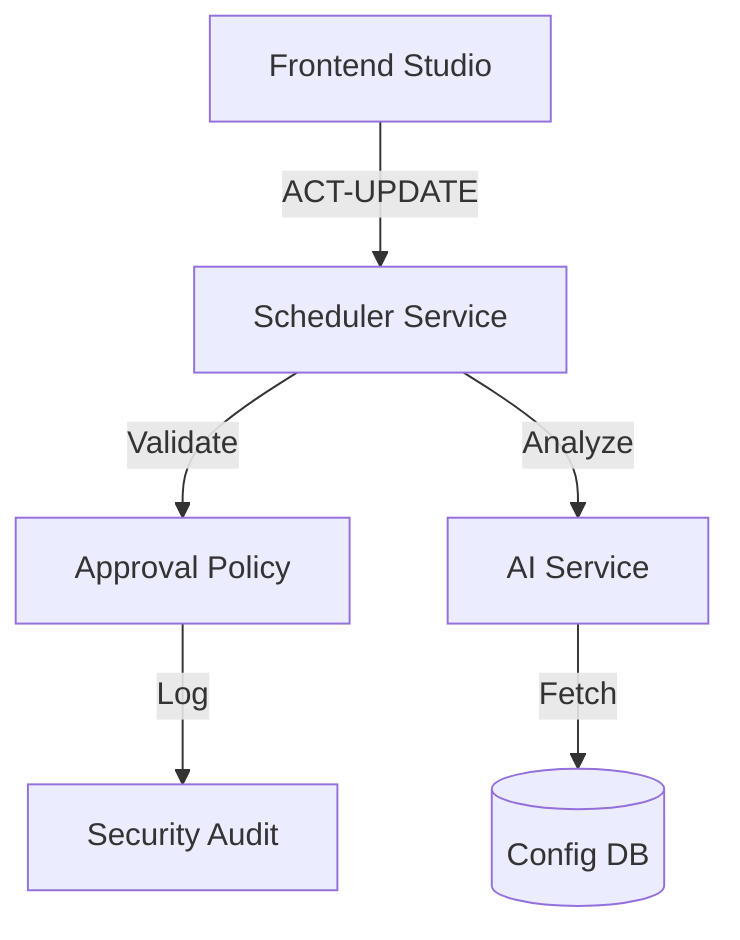

# Studio API Map (v1.0.0)

## Overview

This document maps the core API endpoints of the DGN-DJ Studio Backend, categorizing them by service area.

## 1. Scheduling & UI Services (`/api/scheduler`)

| Endpoint           | Method | Description                                               | Security             |
| ------------------ | ------ | --------------------------------------------------------- | -------------------- |
| `/ui-state`        | GET    | Fetches full scheduler UI state and current timeline.     | Required             |
| `/update`          | POST   | Updates the `schedules.json` with multi-provider support. | ACT-UPDATE-SCHEDULES |
| `/publish`         | POST   | Commits a preview or draft schedule to production.        | ACT-PUBLISH          |
| `/templates/apply` | POST   | Applies a clockwheel template to the active schedule.     | ACT-CONFIG-EDIT      |

## 2. AI Autonomy & Analysis (`/api/ai`)

| Endpoint           | Method | Description                                             | Security      |
| ------------------ | ------ | ------------------------------------------------------- | ------------- |
| `/analyze-track`   | POST   | Triggers AI metadata and acoustic analysis for a file.  | Internal/Role |
| `/generate-script` | POST   | Generates a host break script based on current context. | PRODUCER      |
| `/decision-trace`  | GET    | Returns the reasoning log for the AI's last action.     | OPERATOR      |

## 3. Security & Admin (`/api/security`)

| Endpoint          | Method | Description                                       | Security |
| ----------------- | ------ | ------------------------------------------------- | -------- |
| `/auth/login`     | POST   | Principal authentication and session issuance.    | Public   |
| `/policy/enforce` | POST   | Validates an action against the `ApprovalPolicy`. | Internal |
| `/audit/logs`     | GET    | Retrieves security audit logs in NDJSON format.   | SECURITY |

## Data Flow Diagram

